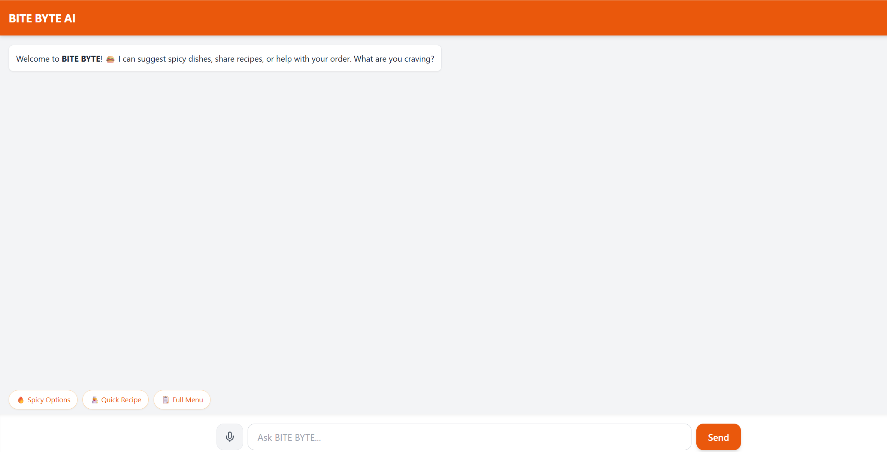
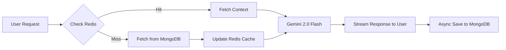

# 🍕 Bite Byte AI Chatbot

Bite Byte is a high-performance, conversational AI assistant designed for food enthusiasts. It provides concise recipes, food suggestions, and pro-tips using the Google Gemini API, with a robust backend architecture optimized for speed and persistence.



## 🚀 Features

- **AI Engine:** Powered by `gemini-2.0-flash` for near-instant responses.
- **Streaming Responses:** Real-time text generation for a smooth UI experience.
- **Dual-Layer Memory:**
    - **Redis:** In-memory caching for ultra-fast retrieval of active conversation context.
    - **MongoDB:** Permanent storage for long-term chat history.
- **Bite-Sized Logic:** Structured system instructions to ensure the bot stays concise and food-focused.
- **Pro Serialization:** Custom JSON encoding to handle MongoDB ObjectIds and Datetimes seamlessly.

## 🛠️ Tech Stack

- **Backend:** Python 3.11, FastAPI, Uvicorn
- **AI SDK:** Google GenAI Python SDK
- **Databases:** MongoDB (Motor driver), Redis (aioredis)
- **DevOps:** Docker, Docker Compose
- **Validation:** Pydantic v2

## 📋 Prerequisites

- [Docker](https://www.docker.com/get-started) and Docker Compose installed.
- A [Google Gemini API Key](https://aistudio.google.com/app/apikey).

## ⚙️ Setup & Installation

1. **Clone the repository:**
   ```bash
   git clone [https://github.com/naresnayak/ai-chatbot.git](https://github.com/naresnayak/ai-chatbot.git)
   cd ai-chatbot

2. **Create a .env file**
Create a `.env` file in the root directory and add your credentials:

    ```env
    GEMINI_API_KEY=your_api_key_here
    MONGO_URL=mongodb://mongo:27017
    REDIS_URL=redis://redis:6379
    ```

3. **Spin up the containers**
Run the following command:

    ```bash
    docker compose up --build
    ```

4. **Access the API**
    - **Backend:** [http://localhost:8000](http://localhost:8000)  
    - **Interactive API Docs (Swagger):** [http://localhost:8000/docs](http://localhost:8000/docs)

## 🏗️ Architecture (Cache-Aside Pattern)

The system is designed to minimize database latency and LLM token costs by maintaining an "Active Context Window" in memory.



## 📜 System Rules (The "Bite Byte" Personality)
To keep the assistant focused and efficient, the following rules are enforced:

- **No Filler:** Avoids introductory phrases like "Namaste" or "I am happy to help."  
- **Concise:** Responses are kept under 200 words.  
- **Structured:** Uses bullet points for ingredients and numbered lists for steps.  
- **Engagement:** Always ends with a relevant follow-up question.  

## 🛣️ API Endpoints
- **POST /chat/stream:** Stream AI responses for a given session.  
- **GET /history/{session_id}:** Retrieve stored chat history from Redis or MongoDB.  

## 🤝 Contributing
Feel free to fork this repository and submit pull requests. For major changes, please open an issue first to discuss what you would like to change.
